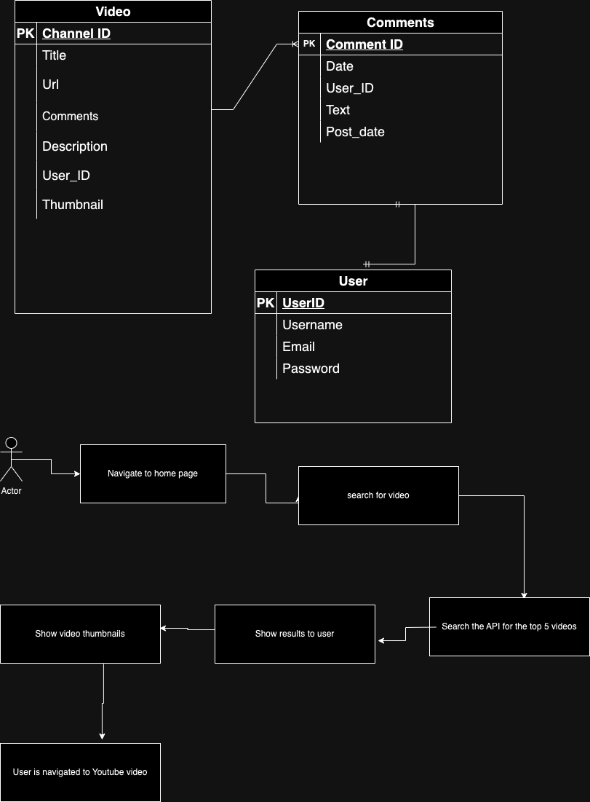

Youtube clone this app will allow you to watch videos that are related to your searches. The user will be allowed to search for videos and upload their own to the site.

Technologies:
HTML, CSS, JavaScript: Basics for building the structure, styling, and interactivity of the user interface.
Node.js: Server-side scripting for handling requests, business logic, and interacting with the database.

API: https://developers.google.com/youtube/v3/docs/search

